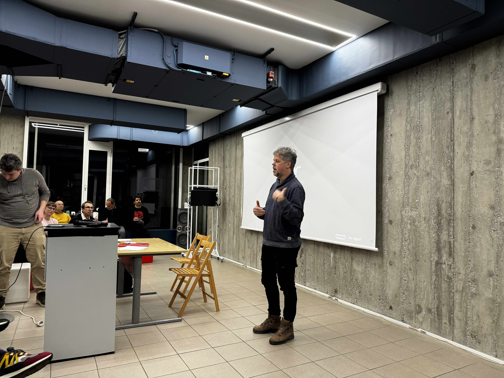

# GeoDev Meetup #11

__Date__: Wednesday, 20.11.2024 at 18:00

__Location__: [Računalniški muzej](https://www.racunalniski-muzej.si/), Celovška cesta 111, 1000 Ljubljana

__Talks__: 

* Flyte - workflow orchestration platform. [Klemen Špruk](https://www.linkedin.com/in/klemen-%C5%A1pruk-66777193/) 
  * [Presentation Flyte.pdf](01-flyte/GeoMeetup%20-%20Flyte.pdf) 
  * Build data and ML workflows for geospatial data while leveraging Flyte's native cloud capabilities.
* Copernicus Browser. [Žiga Černigoj, Sinergise](https://www.linkedin.com/in/ziga-cernigoj/) 
  * [Presentation - GeoDevCopernicusBrowser.pdf](02-copernicus-browser/GeoDevCopernicusBrowser.pdf)
  * EN: The Copernicus Browser democratizes access to rich geospatial datasets, providing an easy-to-use interface for finding and visualizing Earth observation data from the European Union's Copernicus program. The browser makes the data accessible without complex technical setups, fostering collaboration and supporting the development of geospatial applications.
  * SI: Copernicus Browser demokratizira dostop do bogatih naborov geoprostorskih podatkov z enostavnim uporabniškim vmesnikom za iskanje in vizualizacijo podatkov pridobljenih v okviru programa Evropske unije Copernicus za opazovanje Zemlje. Copernicus Browser omogoča dostop do podatkov brez zapletenih tehničnih nastavitev, spodbuja sodelovanje in podpira razvoj geoprostorskih aplikacij. 
* Ustanovna Skupščina Društva OSGeo Slovenija. [Tomaž Šturm](https://www.linkedin.com/in/tomaz-tomas-sturm/)

The event is free and open to all. Join us for an evening of learning and networking with other developers and geospatial enthusiasts.
Rent, pizzas, and drinks are courtesy of [Flycom Technologies](https://www.flycom.si/). 

__(Open an Github issue if you would like to help us with not lose our own money on this one )__ 

